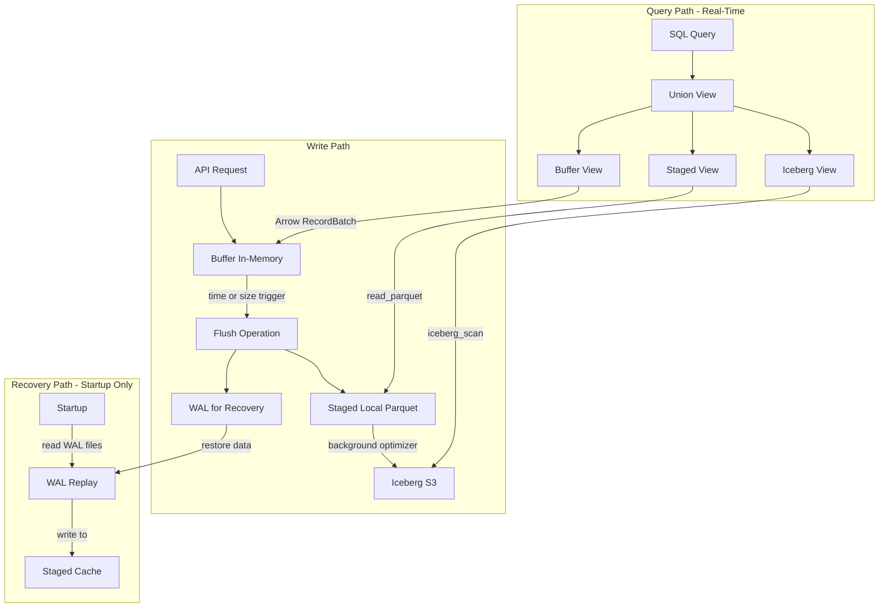

## Context
We need a long-term architecture that avoids Iceberg metadata bloat and small-file churn while enabling sub-second read freshness. The Mooncake whitepaper proposes a write-aware ingestion engine with buffering, object-store WAL, and union-read semantics.

The union-read query path must combine three data sources:
1. **Buffer** (in-memory): Most recent data, not yet flushed
2. **Staged** (local parquet): Flushed but not yet committed to Iceberg
3. **Committed** (Iceberg): Durably committed to object store

WAL (Write-Ahead Log) is for crash recovery only and is NOT part of the query path.

## Goals / Non-Goals
- Goals:
  - Sub-second read freshness without frequent Iceberg commits
  - Controlled metadata growth and larger Parquet files
  - Object-store as source of truth for committed data with fast local WAL/cache
  - DuckDB SQL as the primary query interface with Iceberg catalog compatibility
  - Preserve session-based row-grouping semantics for traces/logs
- Non-Goals:
  - Perfect code reuse with the current commit-per-flush path
  - Building a REST query API as the primary interface (DuckDB is the contract)

## Decisions
- Decision: Replace direct Iceberg commits with a buffer + WAL ingest engine.
  - Why: decouples freshness from metadata commits and reduces write amplification.
- Decision: Use Arrow in-memory buffers and Parquet/Arrow WAL segments that reuse the same schema as Iceberg tables.
  - Why: removes JSON schema duplication (DRY) and allows union-read with DuckDB `read_parquet`/`read_ipc`.
- Decision: Use a local-only WAL as the ingestion source of truth until commit, with object-store uploads only during Iceberg commits.
  - Why: keeps the hot path fast for small row groups and avoids per-write object-store latency.
- Decision: Use DuckDB as the query engine and keep all data paths Iceberg/Catalog compatible.
  - Why: DuckDB is the supported SQL interface and must interoperate with Iceberg catalogs (REST/Glue/etc.) without bespoke APIs.
- Decision: Preserve session-based row-grouping when flushing Parquet for traces/logs.
  - Why: query performance depends on row groups clustered by session and must not regress.
- Decision: Use stable DuckDB views for union-read that combine in-memory buffer snapshots, staged parquet files, and committed Iceberg data. Refresh only on schema change or staged file updates.
  - Why: Sub-second freshness requires querying buffered data directly without disk writes. Avoids rebuilding views on every write while keeping new data visible for real-time queries.
- Decision: WAL is for crash recovery only, written during buffer flush alongside staged files. WAL is NOT part of the query path.
  - Why: Separates concerns - durability (WAL) vs visibility (buffer/staged). Prevents double-reads and maintains clear pipeline semantics.
- Decision: Buffer snapshots are exposed as Arrow RecordBatches and registered with DuckDB as temp tables.
  - Why: Enables querying in-memory data without disk I/O while maintaining Iceberg schema compatibility.

## Architecture Diagram

### Data Flow



**Key Separation**:
- **Write Path**: Buffer → Staged + WAL (dual-write on flush)
- **Query Path**: Buffer ∪ Staged ∪ Iceberg (no WAL)
- **Recovery Path**: WAL → Staged (startup only)

## Deferred
- Iceberg-native index files (Puffin) and deletion vectors are deferred until we have update/delete workloads (e.g., CDC, GDPR deletions, dedup).

## Risks / Trade-offs
- Increased system complexity and more moving parts.
- New operational requirements for local disk/NVMe sizing and health.
- Uncommitted data is not durable across node loss until the commit completes.
- Requires careful recovery semantics to reconcile WAL + buffer + Iceberg snapshots.
- Union-read needs a DuckDB-accessible representation (e.g., temp tables/views) without breaking Iceberg catalog compatibility.
- Session-based row group clustering constrains compaction and file merge policies.

## Lessons Learned

### Mistake: WAL in Query Path (2026-01-25)

**What happened**: Initial implementation included WAL files in the DuckDB union view query path:
- `union_spans = iceberg_spans UNION ALL staged_spans UNION ALL wal_spans`

**Why it was wrong**:
1. WAL is for crash recovery, not queries - mixing concerns
2. Creates double-reads: data appears in both WAL and staged after flush
3. Breaks the buffer → staged → committed pipeline semantics
4. Tests expect immediate buffer visibility, not WAL-delayed visibility

**Correct architecture**:
```
Write Path:     API → Buffer (in-memory) → [flush] → Staged (parquet) + WAL (recovery)
Query Path:     Buffer (in-memory) ∪ Staged (parquet) ∪ Committed (Iceberg)
Recovery Path:  Startup → Read WAL → Restore to Staged
```

**Why buffer must be queryable**:
- Sub-second freshness requirement: queries must see buffered data immediately
- Single-writer single-reader: no concurrency issues with buffer snapshots
- Avoids write amplification: don't write to disk just to make data queryable

**Impact**: Required rearchitecting query engine to snapshot buffer as Arrow RecordBatch and register with DuckDB, rather than reading WAL parquet files.

**Prevention**: Explicit separation in design between:
- Data durability path (buffer → WAL → staged)
- Query visibility path (buffer → staged → committed)
- Recovery path (WAL → staged)

## Migration Plan
1. Implement new ingest engine behind a feature flag.
2. Dual-write for a limited period to validate correctness.
3. Switch query path to union-read for the new engine.
4. Remove legacy commit-per-flush path once validated.

## Open Questions
- Recovery SLA and how much WAL history to retain.
- Default WAL manifest update cadence (seconds vs. file count) and retention horizon for “last N days” queries.
